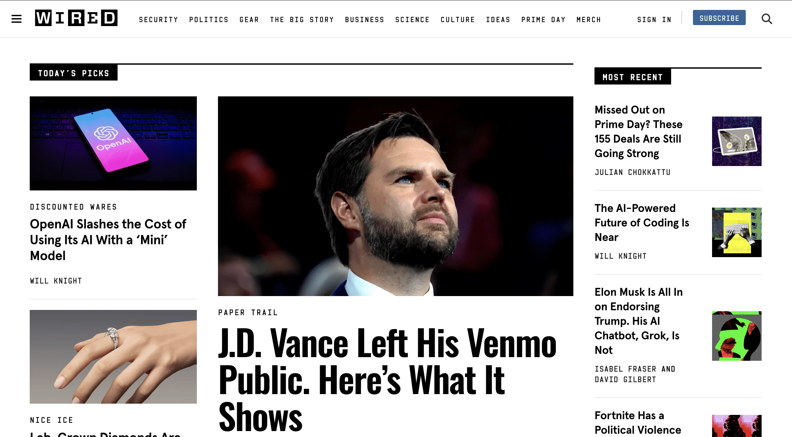

# Paper it

The extension turns colorful and distracting websites into black-and-white newspapers,
allowing you to choose what to read independently of bright covers or colorful fonts.

## Why?

Because I'm tired of the overly colorful video covers, article previews,
and eye-catching font colors that distract from the main content.
I don't want to turn off thumbnails on YouTube, and I don't want to hide images.
I just want to choose the order of viewing the content myself, because my attention belongs to me.

## Demo

| Before                                                | After                                               |
|-------------------------------------------------------|-----------------------------------------------------|
|  |  |

## Thanks

- [Icons8](https://icons8.com) for the [newspaper icon](./icons//icons8-newspaper-48.png)
- [FreeJect Design](https://www.behance.net/freeject) for the [paper textures](./images)
that the extension uses for the background, which I found at https://unblast.com/8-free-detailed-paper-textures-collection-jpg/
